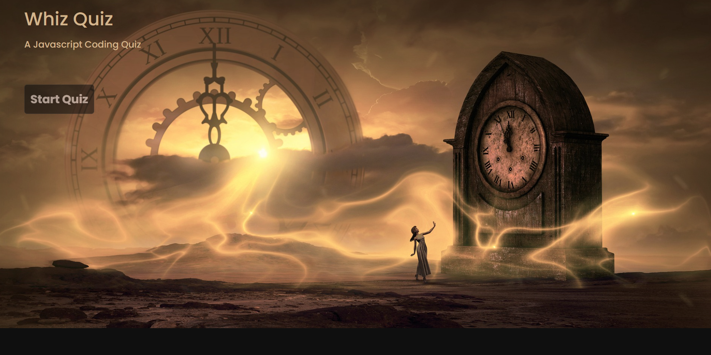

# Whiz-Quiz
Whiz Quiz is a resource for anyone who wants practice Javascript.
Thank you for checking it out.

## Project URL
- [https://kaleikautakaoka.github.io/Whiz-Quiz/](https://kaleikautakaoka.github.io/Whiz-Quiz/)
## Deployment

- [https://kaleikautakaoka.github.io/Whiz-Quiz/](https://kaleikautakaoka.github.io/Whiz-Quiz/)

## Demo/Screenshot

<table>
<tr>
<td>Whiz Quiz</td>
</tr>
<tr>
<td></td>
</tr>
</table>

## Technologies

HTML, CSS, Javascript, Bootstrap

## License

NA

## Resources

[w3schools](https://www.w3schools.com/)
[FlexboxFroggy](https://flexboxfroggy.com/)
[CSS-Tracks](https://css-tricks.com/)
[Youtube](https://www.youtube.com/watch?v=1Rs2ND1ryYc)
[Unsplash](https://unsplash.com/s/photos/hero-header)
[pixabay](https://pixabay.com/illustrations
cloud-computer-circuit-board-cpu-6532831/)
[Devon Abbott](http://dabbott.github.io/javascript-playgrounds/)

## Contact

Email: sasasa@gmail.com

## Author

Author: Sachi Takaoka
GitHub: <https://github.com/kaleikautakaoka/Whiz-Quiz>