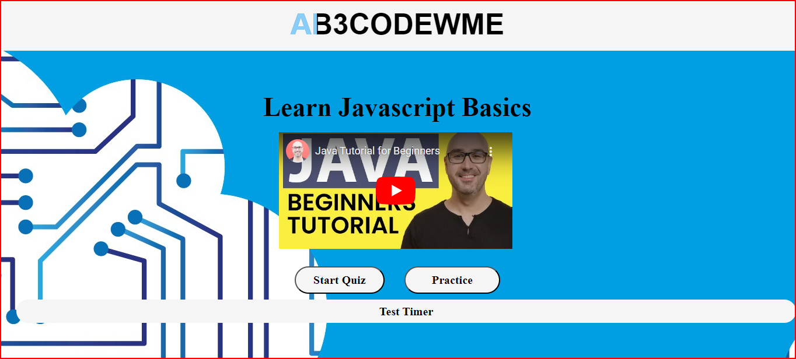

# Whiz-Quiz
Whiz Quiz is a resource for anyone who wants to learn Javascript. This site contains a study/resource page and a short quiz on Javascript.

## Project URL

## Deployment

- [https://kaleikautakaoka.github.io/Virtual-Me/](https://kaleikautakaoka.github.io/Virtual-Me/)

## Demo/Screenshot

<table>
<tr>
<td>Ab3 CodeWMe Page Preview</td>
</tr>
<tr>
<td></td>
</tr>
</table>

## Technologies

HTML, CSS, Javascript

## License

NA

## Resources

[w3schools](https://www.w3schools.com/)
[FlexboxFroggy](https://flexboxfroggy.com/)
[CSS-Tracks](https://css-tricks.com/)
[Youtube](https://www.youtube.com/watch?v=1Rs2ND1ryYc)
[Unsplash](https://unsplash.com/s/photos/hero-header)
[pixabay](https://pixabay.com/illustrations
cloud-computer-circuit-board-cpu-6532831/)
[Devon Abbott](http://dabbott.github.io/javascript-playgrounds/)

## Contact

Email: sasasa@gmail.com

## Author

Author: Sachi Takaoka
GitHub: <https://github.com/kaleikautakaoka>

